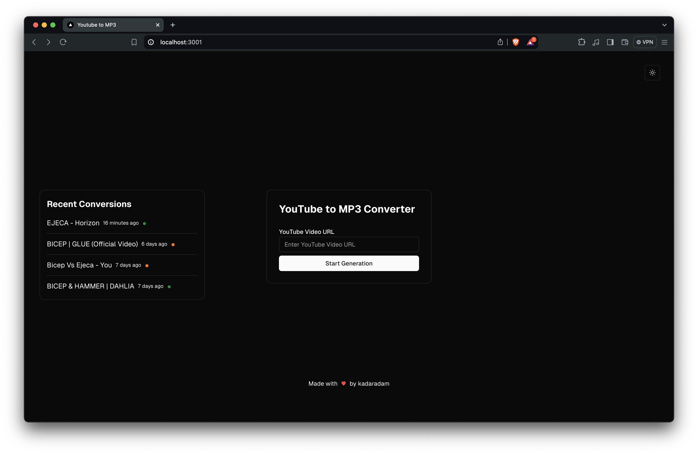
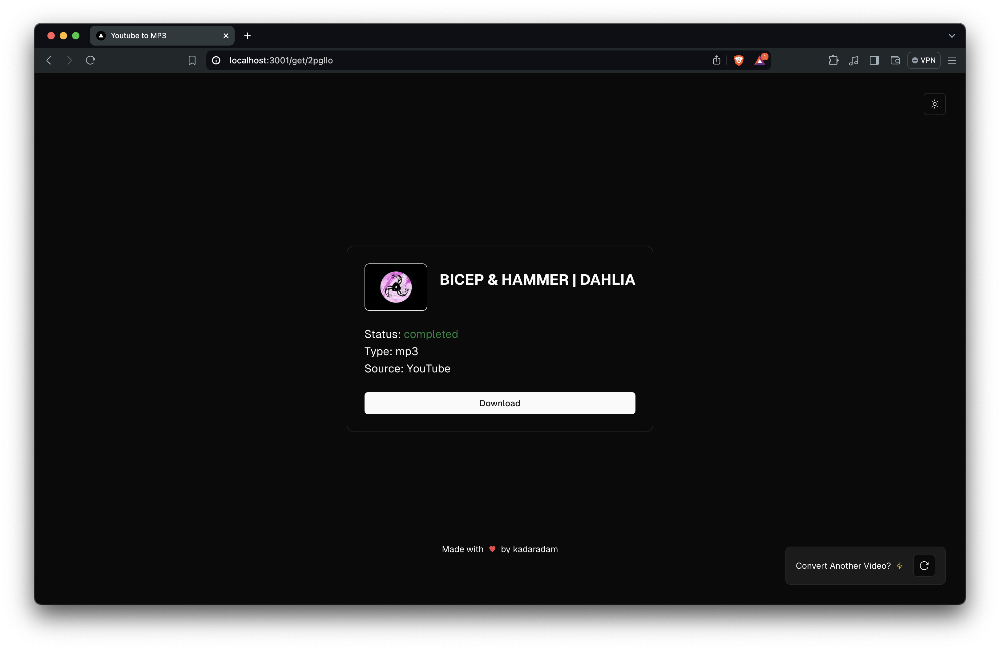
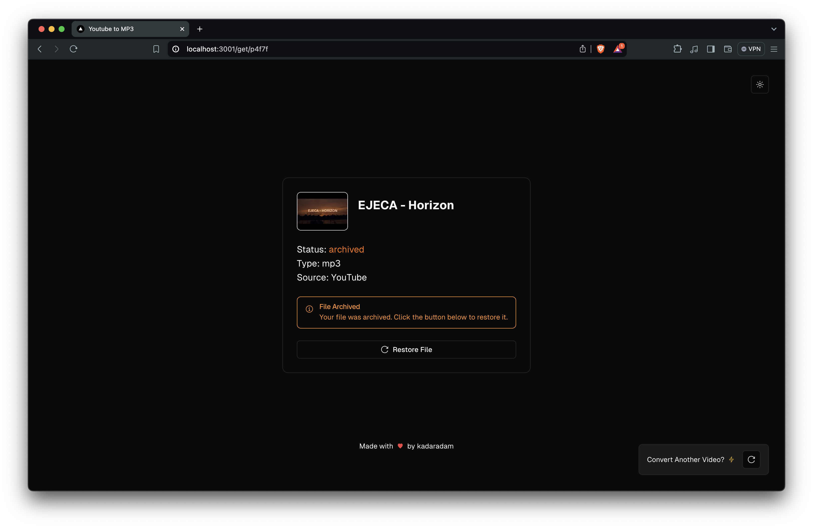

# 🎶 YouTube Music Downloader

Easily download your favorite music from YouTube with blazing speed and real-time feedback! Built with **Bun**, **ElysiaJs**, **RabbitMQ**, **Drizzle ORM**, **Next.js**, **ShadCN**, and **WebSockets**, this app delivers a seamless and modern experience.

<p align="center">
   
</p>
<p align="center">
   
</p>
<p align="center">
   
</p>

## 🚀 Features

- **Real-Time Updates**: Track download progress via WebSockets.
- **Task Queuing**: Reliable background processing with RabbitMQ.
- **Database Management**: Powered by Drizzle ORM for a flexible and efficient database layer.
- **Modern UI**: Built with Next.js and ShadCN for a smooth user experience.

## 🛠️ Tech Stack

- **SST v3**: Serverless Stack
- **AWS**: Lambda, API Gateway, SQS, S3, DynamoDB, WebSockets
- **Modern UI**: Built with Next.js and ShadCN for a smooth user experience.

or

- **Bun**: High-performance runtime.
- **ElysiaJs**: Lightweight API framework.
- **RabbitMQ**: Task queuing for downloads.
- **Drizzle ORM**: Type-safe SQL database management.
- **Next.js & ShadCN**: Modern frontend.
- **WebSockets**: Real-time communication.

## 📦 Getting Started

## 🔧 API

There are 2 versions of the API, one built with **SST v3** and the other with **ElysiaJs**.

### 🗺 [API with **SST v3**](/app/server-sst/README.md)

### 🗺 [API with **ElysiaJs**](/app/server/README.md)

## 💻 Frontend

1. Navigate to the client directory:
   ```bash
   cd app/client
   ```
2. Install dependencies:
   ```bash
   bun install
   ```
3. Copy the `.env.example` file and configure your environment:
   ```bash
    cp .env.example .env.local
   ```
4. Start the client:
   ```bash
    bun run dev
   ```

Enjoy your music! 🎧
